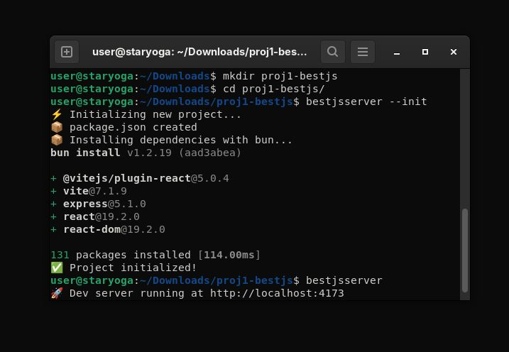

# Best.js Server v0.1

**Simple React SSR with Vite and Express — zero setup CLI**. Made for pure JS or optionally connect with headless CMS's later, such as [empowerd.dev](https://empowerd.dev). 




---

## Install globally

```bash
git clone https://github.com/empowerd-cms/best.js
cd best.js
npm install
npm link
```

---

## 1️⃣ Initialize a new project

```bash
mkdir bestjs-proj1
cd bestjs-proj1
bestjsserver --init # creates /src and vite.config.js + installs dependencies
```

To be exact, this will:

* Create a minimal `package.json` with dependencies (`react`, `react-dom`, `express`, `vite`, `@vitejs/plugin-react`).
* Create a `src` folder with `app.jsx`.
* Create an optional `src/pages/index.jsx`.
* Create `index.html` and `vite.config.js`.
* Installs dependencies as fast as possible with `bun install` (or fallback to `npm install`).

After this, the project is ready to run.

---

## 2️⃣ Run in development mode

```bash
bestjsserver
```

or explicitly:

```bash
bestjsserver --dev
```

**Defaults:**

* Port: `4173`
* Source folder: `./src`

Optional flags:

* `--port <number>` — override default port
* `--src <folder>` — override source folder

This starts the Vite dev server with SSR enabled, dynamically loading pages from `src/pages` or falling back to `src/app.jsx`. It also loads any modules from `src/lib` and `src/api`.

---

## 3️⃣ Run in production mode

```bash
bestjsserver --prod
```

**Defaults:**

* Port: `5173`
* Source folder: `./src`

Behavior:

* Serves static files from `dist/client`.
* Loads API and lib modules from `src`.
* Renders pages from `src/pages` or fallback to `src/app.jsx`.

Optional flags:

* `--port <number>` — override default port
* `--src <folder>` — override source folder
* `--build` — force rebuild before starting

If `dist` is missing, the CLI automatically runs:

```bash
npm run build:client
npm run build:server
```

---

## 4️⃣ Folder Structure

After `--init`, your project will look like:

```
project-root/
├─ src/
│  ├─ app.jsx
│  ├─ pages/
│  │  └─ index.jsx   (optional)
│  ├─ api/           (optional API modules)
│  └─ lib/           (optional helper modules)
├─ index.html
├─ vite.config.js
├─ package.json
```

---

## 5️⃣ API and Lib modules

* Any `.js` or `.ts` file inside `src/api` or `src/lib` is automatically loaded.
* If it exports a default function, it will be called with the Express `app`.

Example:

```js
// src/api/users.js
export default function register(app) {
  app.get('/api/users', (req, res) => {
    res.json([{ id: 1, name: 'Alice' }]);
  });
}
```

## Add pages
```
mkdir src/pages
vim src/pages/about.jsx
```

about.jsx:
```
export default function About() {

  return (
    <div style={{ margin: '2rem' }}>
      <h1>About page :)</h1>
    </div>
  );
}
```

## Add Existing React Modules

Install a React module of choice, ex codemirror:
```
npm install @uiw/react-codemirror @codemirror/lang-javascript
```

```
vim src/pages/editor.jsx
```

editor.jsx:
```
import React, { useEffect, useState } from 'react';

export default function Editor() {
  const [isClient, setIsClient] = useState(false);
  const [CodeMirror, setCodeMirror] = useState(null);
  const [javascript, setJavascript] = useState(null);
  const [code, setCode] = useState('// Write JS code here');

  useEffect(() => {
    setIsClient(true);
    // Dynamically import CodeMirror on client only
    import('@uiw/react-codemirror').then(mod => setCodeMirror(() => mod.default));
    import('@codemirror/lang-javascript').then(mod => setJavascript(() => mod.javascript));
  }, []);

  if (!isClient || !CodeMirror || !javascript) {
    return <div>Loading editor...</div>;
  }

  return (
    <div style={{ margin: '2rem' }}>
      <h1>CodeMirror Editor :)</h1>
      <CodeMirror
        value={code}
        extensions={[javascript()]}
        onChange={setCode}
        height="400px"
      />
      <pre>{code}</pre>
    </div>
  );
}

```


### Set Custom Title with getServerSideProps
```
// src/app.jsx 
import React, { useState } from 'react';

export async function getServerSideProps(context) {
  const pageTitle = "Welcome | My App"; // could come from DB or API
  return {
    props: { title: pageTitle }, // passed as props to the component
  };
}


const App = () => {
  const [count, setCount] = useState(0);
  return (
    <main>
      <h1>App</h1>
      <p>Hello SSR + Vite!</p>
      <div>
        <div>{count}</div>
        <button onClick={() => setCount(count + 1)}>Increment</button>
      </div>
    </main>
  );
};

export default App;


```

---

## 6️⃣ Notes

* Pages are dynamically loaded for SSR: `/pages/<pagename>.jsx`.
* If a page does not exist, it falls back to `src/app.jsx`.
* Dev mode uses Vite middleware; production mode serves from `dist/client` and dynamically renders pages.

